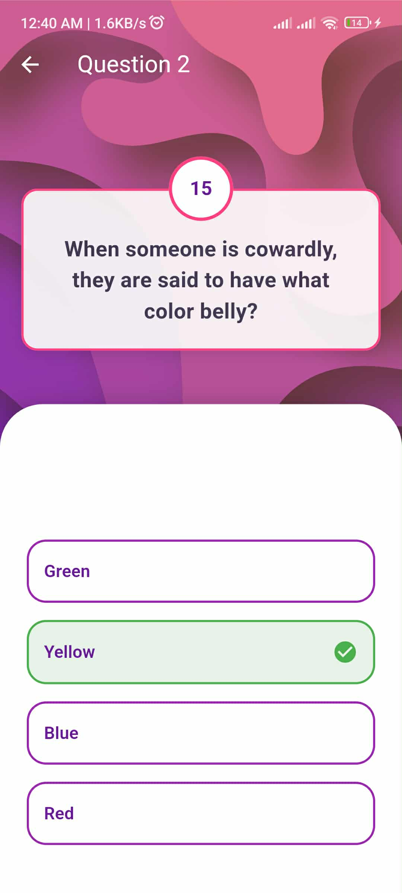
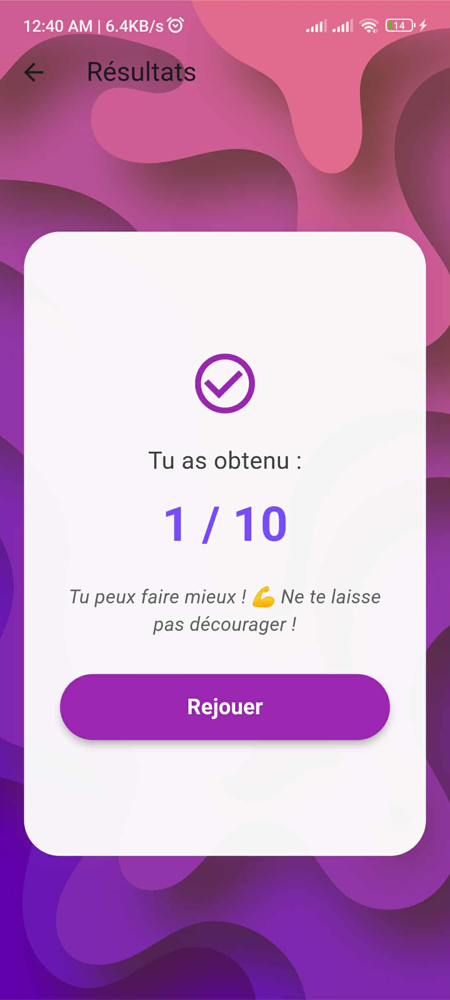

# 🎯 Flutter Quiz App

Bienvenue dans **Flutter Quiz App**, une application mobile interactive développée avec **Flutter**, qui permet aux utilisateurs de tester leurs connaissances à travers des séries de questions à choix multiples.

---

## 🚀 Fonctionnalités principales

- 🧩 Interface intuitive et moderne  
- ⏱️ Chronomètre pour chaque question  
- ✅ Vérification instantanée des réponses  
- 📊 Résumé du score à la fin du quiz  
- 🌙 Mode clair et sombre  
- 🔄 Rejouer le quiz à tout moment  
- 🧠 Base de données de questions extensible  

---

## 🏗️ Technologies utilisées

- **Flutter** (SDK de développement multiplateforme)  
- **Dart** (langage principal)  
- **GetX / Provider** (gestion d’état)  
- **JSON** pour le stockage local des questions  
- **Google Fonts** et **Lottie** pour un design professionnel  

---

## 📱 Aperçu de l’application

<p align="center">
  
  
  
</p>

---

## ⚙️ Installation

1. Clone le projet :
   ```bash
   git clone https://github.com/<ton-nom-utilisateur>/flutter_quiz_app.git
